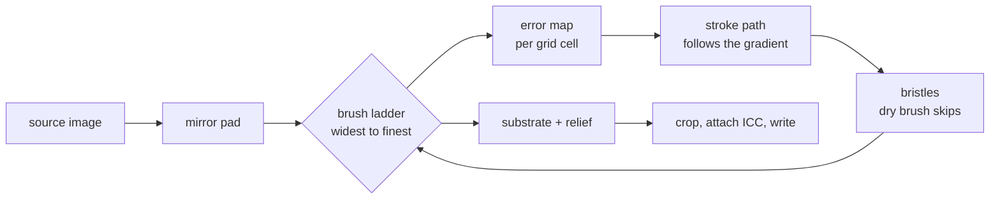

```
 ██████╗ ██████╗ ██╗   ██╗███████╗██╗  ██╗
 ██╔══██╗██╔══██╗██║   ██║██╔════╝██║  ██║
 ██████╔╝██████╔╝██║   ██║███████╗███████║
 ██╔══██╗██╔══██╗██║   ██║╚════██║██╔══██║
 ██████╔╝██║  ██║╚██████╔╝███████║██║  ██║
 ╚═════╝ ╚═╝  ╚═╝ ╚═════╝ ╚══════╝╚═╝  ╚═╝
 ██╗    ██╗ ██████╗ ██████╗ ██╗  ██╗
 ██║    ██║██╔═══██╗██╔══██╗██║ ██╔╝
 ██║ █╗ ██║██║   ██║██████╔╝█████╔╝
 ██║███╗██║██║   ██║██╔══██╗██╔═██╗
 ╚███╔███╔╝╚██████╔╝██║  ██║██║  ██╗
  ╚══╝╚══╝  ╚═════╝ ╚═╝  ╚═╝╚═╝  ╚═╝
```

<div align="center">

### `PHOTOGRAPH IN // PAINTING OUT`

*every stroke is placed, angled and loaded by an algorithm that has never seen a painting*


-3f6212?style=flat-square&labelColor=111111)


</div>

---

## 🎨 What is this

brushwork repaints an image as visible brush strokes. Not a blur, not a posterise
filter, not a model that has memorised Van Gogh: it decides where a stroke goes,
which way it points, how many hairs the brush has and how much paint each one is
still carrying, then it puts that stroke down and looks at what is left to fix.

The placement is Hertzmann's layered algorithm from 1998. Four coarse-to-fine
passes by default, each one comparing the canvas against a blurred reference
and seeding a stroke only where the canvas is currently wrong. Flat sky earns a
handful of broad strokes. A treeline earns hundreds of fine ones. Strokes run
perpendicular to the luminance gradient, which is why the paint appears to follow
the form of whatever it is painting.

It was built for wallpapers, so brush size is a fraction of image width rather
than a pixel count: a 1080p and a 6K copy of the same photo come out looking like
the same painting at two print sizes. The canvas weave, the paper grain and the
light on the ridges of thick paint are all generated. Nothing here ships a texture
someone else photographed.

```console
nick@brushwork:~$ brushwork tower.jpg --sheet
[✓] tower.sheet.png  2748x2220  12 cells  4.3s
[i] every style, two brush sizes, textured and bare. pick one, then render it properly.
```

## 🖌 The three media

| | style | what it actually does |
|---|---|---|
| 01 | **oil** | bristle strokes on generated linen, built up over a blurred underpainting, then lit from the upper left so thick paint stands off the surface |
| 02 | **water** | low-opacity washes on cold-press paper, pigment darkening where a wash met its edge. multiply blending was tried and is wrong: repeated washes compound towards black instead of towards the colour |
| 03 | **ink** | one nib, no colour. tone comes out as hatching density, short marks rather than long ones, skipping wherever the paper fibre dips |

Three configs, one engine. A style is a dictionary of numbers: bristle count,
opacity, blend mode, jitter, starting surface, post-pass.

## 🚀 Run it

Needs Node 18.17 or newer. sharp ships prebuilt binaries, so there is nothing to
compile.

```bash
bun install -g brushwork                      # or: npm install -g brushwork
brushwork photo.jpg --sheet                   # decide which style suits it
brushwork photo.jpg --style oil --brush 1.4   # then render it properly
```

Or without installing anything, for a one-off:

```bash
npx brushwork photo.jpg --style oil
```

Installing is the better default. One sitting is usually a sheet, a preview, a
render and then a second render with the numbers moved, and npx re-resolves the
package on every one of those.

A full 4K render takes about seven seconds. `--preview` does the same picture at
1200px in under one, which is what you want while you are still dialling flags in.

### For agents

`brushwork-cli/SKILL.md` is an agent skill for driving the tool: what each flag
really controls, what each command costs, and the traps. Copy the directory into
`~/.claude/skills/` (or point whatever agent you use at the file). Publishing to
npm means nothing installs it for you.

Everything in brushwork runs unattended. There is no TUI, no picker and no
prompt, so an agent can call any of it directly. The one thing worth telling it is
that a 5K render takes the better part of a minute.

## 🔩 Under the hood



| file | job |
|---|---|
| `src/cli.ts` | flags, globs, output naming, the comparison sheet |
| `src/paint.ts` | the engine: brush ladder, error map, stroke paths, bristles |
| `src/styles.ts` | the three media, as numbers |
| `src/texture.ts` | generated weave and paper, and the light on thick paint |
| `src/image.ts` | sharp in and out, mirror padding, ICC profile handling |

Full design record, including what was rejected and why, in
[PRODUCT.md](PRODUCT.md).

**Stack:** TypeScript · Bun · sharp (libvips)

---

<div align="center">

**[Nick Trimandylis](https://github.com/nitrimandylis)**

`NO MODEL WEIGHTS. NO REFERENCE PAINTINGS. JUST ARITHMETIC AND A LOT OF SMALL DECISIONS`

MIT licensed.

</div>
